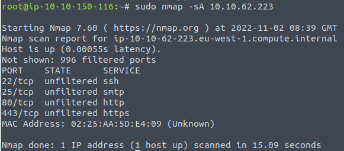

# FireWall-Nmap-Scans
Sample of NMAP scans targeted at Firewalls, their configurations and systems behind the Firewalls.

## ACK Scan

The ACK scan is able to discover firewall rule sets and configuration.
**Context** Firewall in front of the target. Result of scan, result indicate which ports were not blocked by the firewall. 

```bash
sudo nmap -sA $TARGET
```

### Notice the unfiltered state of the open ports


## NULL Scan

The NULL scan work on the fact it get no response back.
**Context** No reply in a null scan indicates that either the port is open or a firewall is blocking the packet. Alternatively, there is a possibility that the ports are not responding due to a firewall rule.

```bash
sudo nmap -sN $TARGET
```

## FIN Scan

The FIN scan also work on the fact the scan do not get a response back if port open.
**Context** Results could be false positive if the port is open or if a firewall is blocking the traffic. Firewalls may quietly drop the traffic without sending an RST.

```bash
sudo nmap -sF $TARGET
```

