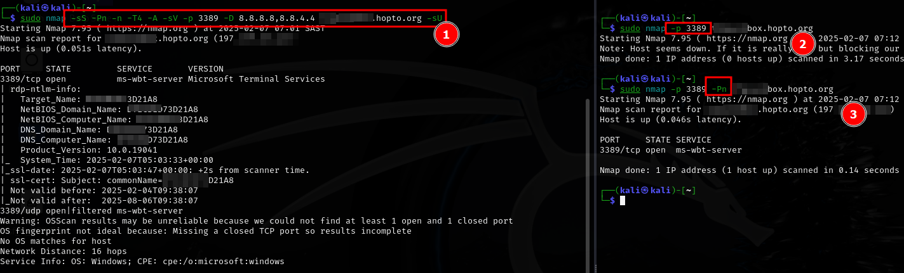
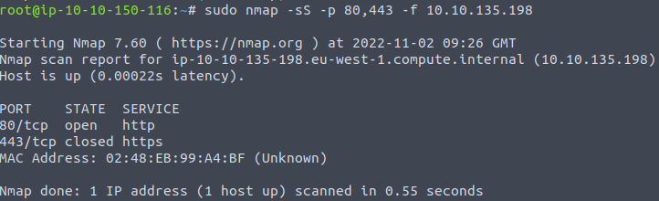

# FireWall-Nmap-Scans
Sample of NMAP scans targeted at Firewalls, their configurations and systems behind the Firewalls.  
These can be usefull in a external penetration test to validate firewall configuration or detect open services behind firewalls from public facing attacks.  

## Decoy Scan 

>This scan use decoy public dns ip address to scan target and avoid IPS.  
>[Firewall and IDS/IPS Evasion - HackTheBox Academy](https://academy.hackthebox.com/module/19/section/106) Scan by Using Decoys.  
>UDP scan is activated with the `-sU` option. It can be combined with a TCP scan type such as SYN scan `-sS` to check both protocols during the same NMAP Decoy Scan.  

```bash
sudo nmap -sS -Pn -n -T4 -A -sV -p 3389 -D 8.8.8.8,8.8.4.4 10.129.2.48 -sU
```  

>Below NMAP scan examples:

1. ***Decoy scan*** `` and comining it with UDP `-sU` + TCP SYN scan `-sS` and `-Pn` Treat all hosts as online, skip host discovery, include Set timing template higher `-T4`
2. Basic scan of only port `3389` default ***NMAP SYN Scan***  
3. NMAP SYN Scan plus `-Pn` Treat all hosts as online, skip host discoveryt  

>Other Switches:  

* `-n` Never do DNS resolution  
* `-A` Enable OS detection, version detection, script scanning, and traceroute  
* `-sV` Probe open ports to determine service/version info
* `-p 3389` Pport ranges or Only scan specified ports  

  

## ACK Scan

>The ACK scan is able to discover firewall rule sets and configuration.  
>**Context** Firewall in front of the target. The result indicate which ports were not blocked by the firewall. 

```bash
sudo nmap -sA $TARGET
```

#### Notice the unfiltered state of the open ports


## NULL Scan

>The NULL scan work on the fact it get no response back.  
>**Context** No reply in a null scan indicates that either the port is open or a firewall is blocking the packet. Alternatively, there is a possibility that the ports are not responding due to a firewall rule.

```bash
sudo nmap -sN $TARGET
```

## FIN Scan

>The FIN scan also work on the fact the scan do not get a response back if port open.  
>**Context** Results could be false positive if the port is open or if a firewall is blocking the traffic. Firewalls may quietly drop the traffic without sending an RST.

```bash
sudo nmap -sF $TARGET
```

## WINDOW Scan

>The WINDOW scan checks the TCP Window field of the RST packets returned.  
>**Context** WINDOW scan against a server behind a firewall, ports are detected as closed, but the firewall does not block them.

```bash
sudo nmap -sW $TARGET
```

## FRAGMENTED Scan

>The FRAGMENTED scan may, depending on the type of firewall/IDS, dividing the packet into smaller packets, get positive results.  
>**Context** An intrusion detection system (IDS) inspects network packets, and raises an alert whenever a malicious rule is met.  

```bash
sudo nmap -sS -f $TARGET
```

####  Use a stealth TCP SYN scan with single -f switch to split packets into 8 bytes. 


